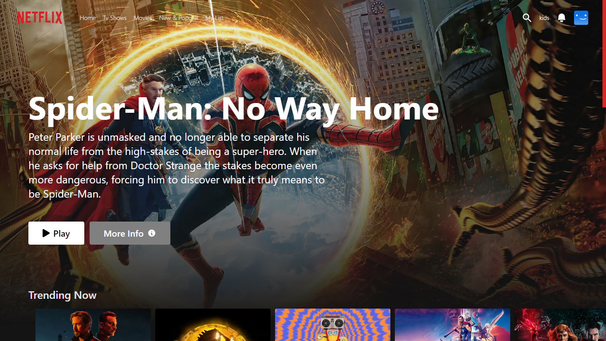
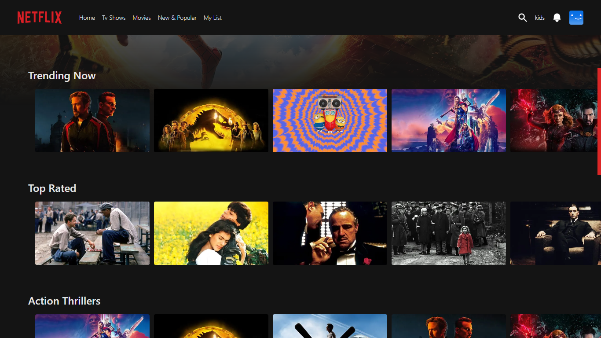

# Project Description

This is a re-design of the Netflix web-app...Built with next js(TypesCript) and tailwind-css. Firebase is used for userAuthentication.

## View demo on

https://netflix-redesign-samyusuf101.vercel.app

# Screenshots

## Installation and usage

Clone this repository

git clone https://github.com/SamYusuf101/Netflix-re-design.git

## Install packages

npm install
npm run dev

## Star, Fork, Clone & Contribute

Feel free to contribute to this repository
